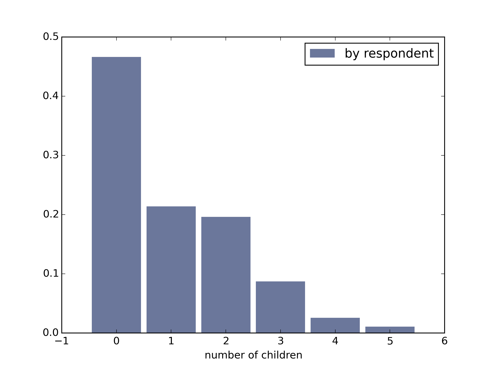

[Think Stats Chapter 3 Exercise 1](http://greenteapress.com/thinkstats2/html/thinkstats2004.html#toc31) (actual vs. biased)

>> The average number of children in a household appears to be different depending on whether you survey mothers or children, due to the bias introduced by the very presence of children. For example, when surveying children, you could never get a response of '0 children in my household' because there would be at least one child (the one being surveyed). This clearly skews the data, as it's clear from the unbiased PMF that 0 children per household is in fact the most common occurrence.
>> 
>> Here is the actual PMF (from the perspective of the female respondents surveyed):
>> 
>> And here is the biased PMF (from the perspective of the children surveyed):
>> 
>> For reference, here are both PMFs plotted side by side:
>> 
>> 
>> As expected, the number of households with 0 children or 1 child are under-represented when surveying the children themselves, whereas the households with multiple children are over-represented.
>> 
>> The actual mean number of children per household is 1.024205, and the biased mean number of children per household is 2.403679.
>> 
>> Note that even the 'actual' numbers are somewhat inaccurate, because a response of '5' to this survey question translates to "5 or more children". We might use the variable `parity` to get a more accurate count of number of children born to a single female respondent, although then we run into the ambiguity of whether or not those children remain as part of the household.
>> 
>> Below, I've included the code used to plot these PMFs and to compute the means.

```
import chap01soln
import thinkstats2
import thinkplot

def BiasPmf(pmf):
    """Returns a new PMF that is biased from the perspective of the 
    group being counted.

    pmf: a Pmf object

    returns: a (biased) Pmf object
    """

    new_pmf = pmf.Copy()
    for x, p in pmf.Items():
        new_pmf.Mult(x, x)
    new_pmf.Normalize()
    return new_pmf

def main():
    resp = chap01soln.ReadFemResp()
    kidsPmf = thinkstats2.Pmf(resp.numkdhh)
    thinkplot.Hist(kidsPmf, label = 'by respondent')
    thinkplot.Save('kidsPmf', ['png'], xlabel = 'number of children')
    biasedPmf = BiasPmf(kidsPmf)
    thinkplot.Hist(biasedPmf, label = 'by child')
    thinkplot.Save('biasedPmf', ['png'], xlabel = 'number of children')
    thinkplot.PrePlot(2)
    thinkplot.Hist(kidsPmf, align = 'right', width = .45, label = 'by respondent')
    thinkplot.Hist(biasedPmf, align = 'left', width = .45, label = 'by child')
    thinkplot.Save('bothPmfs', ['png'], xlabel = 'number of children')
    print 'The actual mean number of children per household is:', kidsPmf.Mean()
    print 'The biased mean number of children per household is:', biasedPmf.Mean()

if __name__ == '__main__':
    main()
```