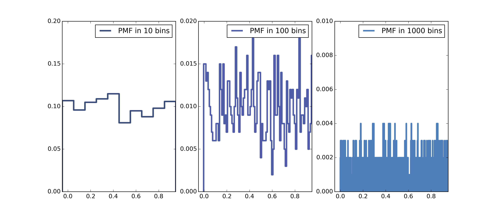
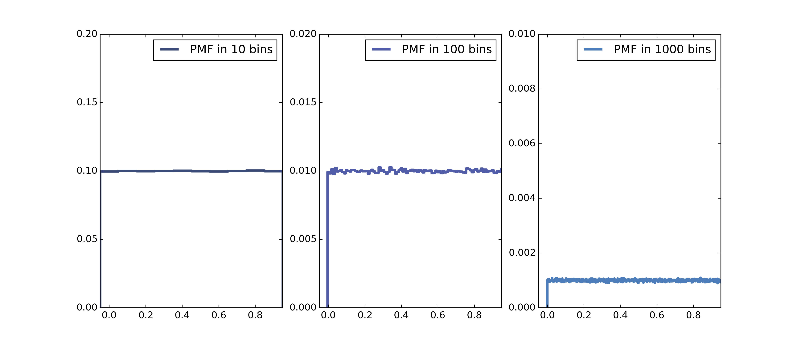
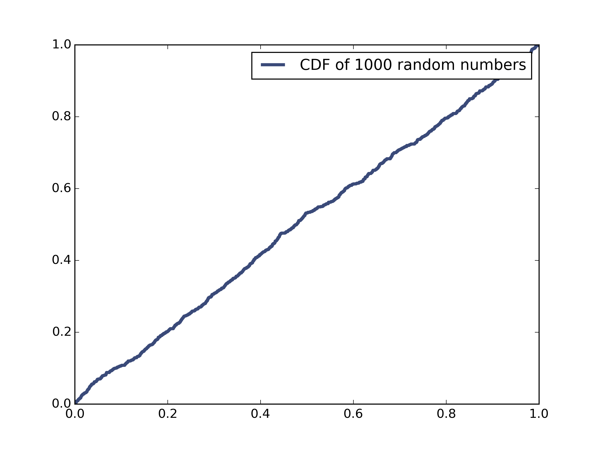
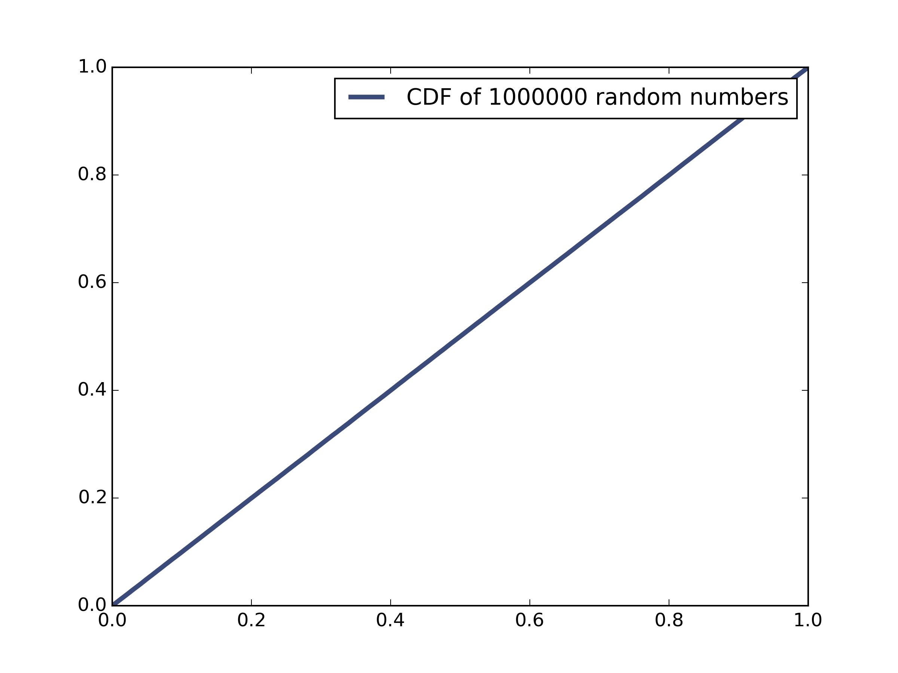

[Think Stats Chapter 4 Exercise 2](http://greenteapress.com/thinkstats2/html/thinkstats2005.html#toc41) (a random distribution)

>> The `random` module in Python contains a powerful suite of pseudorandom number generators, most of them based off the engine of the `random.random` function. `random.random` outputs numbers between 0.0 and 1.0, including 0 but not 1. This function "produces 53-bit precision floats and has a period of 2**19937-1" (from [Python docs](https://docs.python.org/2/library/random.html)). 
>> 
>> "53-bit precision" means that the decimal values it produces use 53 bits worth of memory, i.e. they are decimals up to about 16 digits (after the decimal point) long. 
>> 
>> "period of 2**19937-1" refers to the fact that the numbers generated are not truly random, but rather come in a deterministic order that only repeats after 2^19937-1 terms.
>> 
>> The code at the bottom of the markdown file generates 1000 random numbers using `random.random`, then plots their PMF and CDF graphs. For the PMF pictures, I binned the 1000 numbers by tenths, hundredths, and thousandths to arrive at the following three representations:
>> 
>> As expected, the PMFs look relatively similar to a uniform distribution, with obvious noisy peaks and valleys especially as the bins get smaller. I figured that if I were to use a larger array of random numbers, I would get a smoother PMF even with 1000 bins. Below is the result of generating 1 million random numbers:
>> 
>> This is pretty good evidence that `random.random` does a good job at creating a uniform distribution.
>> 
>> Further evidence is the representation of the CDF of the distributions, first with 1000 random numbers, then with 1 million:
>> 
>> 
>> The line y = x pops right out (especially in the latter of these two photos), which is the telltale sign of a uniform CDF.
>> 
>> A note on the usage of the script below: command line syntax is `$ Ex4_2.py 1000` for the first set of pictures, and `$ Ex4_2.py 1000000` for the second set.

```
import sys
import thinkstats2
import thinkplot
import random
import math

def ToBin(pmf, numBins):
    """Returns a binned version of the pmf it reads in.

    pmf: pmf of random numbers between 0 and 1
    numBins: number of bins in new pmf

    returns: new pmf with values put into numBins equally spaced bins.
    """

    binDict = {}
    for val in pmf.Values():
        roundDown = math.floor(numBins * val) / numBins
        binDict[roundDown] = binDict.get(roundDown, 0) + 1
    return thinkstats2.Pmf(binDict, label = 'PMF in '+str(numBins)+' bins')
    

def main(name, n, *args):
    n = int(n)
    randlist = []
    # Create list of n numbers
    for i in range(n):
        randlist.append(random.random())
    
    # Create PMF of n numbers, as well as binned versions
    randPmf = thinkstats2.Pmf(randlist, label = 'PMF of '+str(n)+' random numbers')
    randPmf_binned_tenth = ToBin(randPmf, 10)
    randPmf_binned_hundredth = ToBin(randPmf, 100)
    randPmf_binned_thousandth = ToBin(randPmf, 1000)

    # Create CDF of n numbers, using the PMF as a constructor argument
    randCdf = thinkstats2.Cdf(randPmf, label = 'CDF of '+str(n)+' random numbers')

    # Plot all three binned versions of PMF on one image file
    thinkplot.PrePlot(cols = 3)
    thinkplot.Pmf(randPmf_binned_tenth)
    thinkplot.Config(axis = [-.05,.95,0,.2])
    thinkplot.SubPlot(2)
    thinkplot.Pmf(randPmf_binned_hundredth)
    thinkplot.Config(axis = [-.05,.95,0,.02])
    thinkplot.SubPlot(3)
    thinkplot.Pmf(randPmf_binned_thousandth)
    thinkplot.Save('binnedPmfs'+str(n), ['png'], axis = [-.05,.95,0,.01])
    
    # Plot CDF image separately
    thinkplot.Cdf(randCdf)
    thinkplot.Save('randCdf'+str(n), ['png'])

if __name__ == '__main__':
    main(*sys.argv)
```