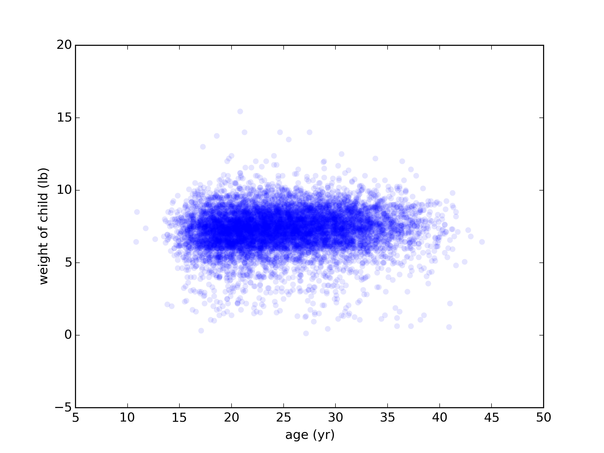
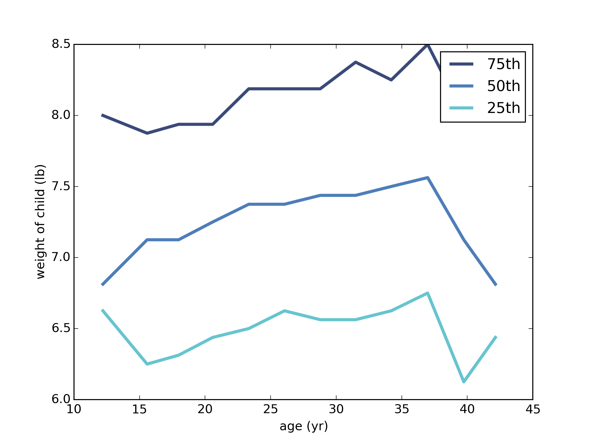

[Think Stats Chapter 7 Exercise 1](http://greenteapress.com/thinkstats2/html/thinkstats2008.html#toc70) (weight vs. age)

>> This exercise asks us to use the NSFG data to compare birth weight versus mother's age. My first thought was that I would be surprised to find out that these two variables are correlated in any meaningful way. As it turns out, the data seems to back this up. 
>> 
>> The scatter plot of age vs. weight, shown below, shows that the stark majority of children born are 6-8 pounds, born pretty consistently at each of these weights to all women between ages 15 and 35. The outliers are scattered somewhat randomly, perhaps tending a bit more towards the lighter side of birth weight.
>> 
>> This "rectangle" of values seems to imply on its own that there is no particular correlation, but we will see the same result a few different ways.
>> 
>> The plot of binned ages versus percentiles of weight show a little more detail, with perhaps a slight positive correlation hinted at up to age 25.
>> 
>> Finally, if we look at the Pearson's correlation (0.0688) and the Spearman's correlation (0.0946), we see values that are close to zero, implying no linear relationship between the two variables. While there might be some kind of non-linear relationship, nothing in particular pops out from these particular analyses.
>> 
>> The code that generated the figures above (as well as the correlation estimates) is copied below:

```
import nsfg
import thinkstats2
import thinkplot
import numpy as np
import pandas

def getValidPreg():
    """Reads and appropriately subsets the NSFG Pregnancy Data Set
    for usage in this program.

    returns: cleaned subset of full preg data set (pandas DataFrame)
    """

    preg = nsfg.ReadFemPreg()
    live = preg[preg.outcome == 1]
    valid = live.dropna(subset = ['totalwgt_lb', 'agepreg'])
    return valid

def plotScatter(xs, ys, labels):
    """Draws a scatter plot with the given variables and the given 
    axis labels.
    
    xs, ys: sequences of (numerical) data
    labels: list of two strings to put on x- and y-axes (respectively)

    returns: None
    """

    thinkplot.Scatter(xs, ys, alpha = 0.1)
    thinkplot.Save('weightVage', ['png'], 
    				xlabel = labels[0], 
    				ylabel = labels[1])

def plotBinnedPercentiles(df, b, p_ranks, labels): 
    """Bin the xs variable into b bins, create a Cdf of ys within each
    bin, and plot lines for each percentile in p_ranks of xs vs ys.

    df: data frame containing birth data
    b = number of bins
    p_ranks: list of numbers (0 <= p_ranks <= 100)
    labels: list of strings to label axes

    returns: None
    """
    
    weights, ages = df.totalwgt_lb, df.agepreg
    xmin, xmax = np.min(ages), np.max(ages)
    bins = np.arange(xmin, xmax, (xmax - xmin) / b)
    indices = np.digitize(ages, bins)
    groups = df.groupby(indices)
    xs = [group.agepreg.mean() for i, group in groups]
    cdfs = [thinkstats2.Cdf(group.totalwgt_lb) for i, group in groups]
    thinkplot.PrePlot(len(p_ranks))
    for percent in p_ranks:
        ys = [cdf.Percentile(percent) for cdf in cdfs]
        label = '%dth' % percent
        thinkplot.Plot(xs, ys, label = label)
    thinkplot.Save('weightVageBinnedPerc', 
    			['png'], xlabel = labels[0], 
    			ylabel = labels[1])

def printCorr(xs, ys):
    """Converts xs, ys to pandas Series (if they aren't already)
    and computes Pearson and Spearman correlations.

    xs, ys: sequences of data
    
    returns: None (prints instead)
    """

    xs = pandas.Series(xs)
    ys = pandas.Series(ys)
    print 'The Pearson correlation is:',
    		thinkstats2.Corr(xs, ys)
    print 'The Spearman correlation is:', 
    		xs.corr(ys, method = 'spearman')

def main():
    df = getValidPreg()
    weights, ages = df.totalwgt_lb, df.agepreg
    print type(weights)
    axes_labels = ['age (yr)', 'weight of child (lb)']
    plotScatter(ages, weights, axes_labels)
    plotBinnedPercentiles(df, 12, [75, 50, 25], axes_labels)
    printCorr(weights, ages)

if __name__ == '__main__':
    main()
```