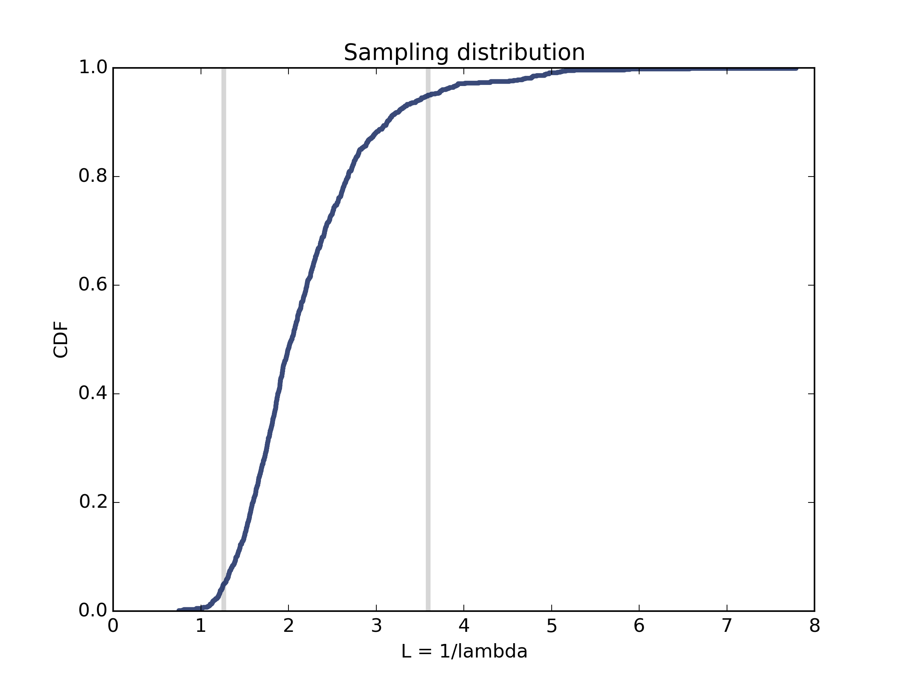
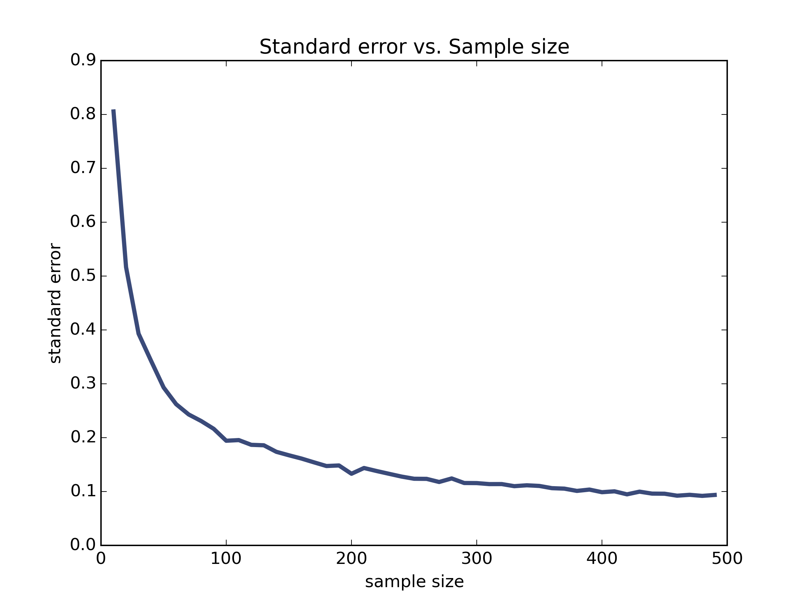
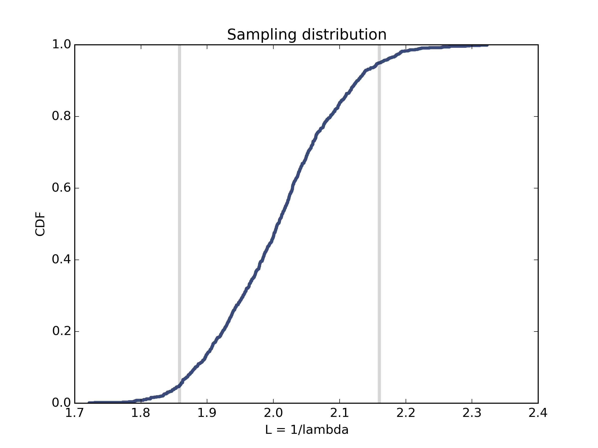

[Think Stats Chapter 8 Exercise 2](http://greenteapress.com/thinkstats2/html/thinkstats2009.html#toc77) (scoring)

>> This exercise focuses on drawing samples from a exponential distribution with `lam = 2`, and measuring the accuracy of the estimator `L = 1 / xbar` for `lam`. With a sample size of `n = 10`, the standard error comes out to about 0.8056, and the 90% confidence interval is (1.2619, 3.5916). The CDF of the sampling distribution for `n = 10` is shown below:
>> 
>> This picture additionally shows that the lowest estimate for lambda was just below 1 and the highest estimate was almost 8. 
>> 
>> What's most interesting to me was seeing how the standard error of the estimator `L` shrunk down as we increased the sample size. To do this, I repeated this experiment with different sample sizes from 10 to 500 (jumping by intervals of 10 each time). The plot of standard error versus sample size is shown below:
>> 
>> As the sample size grows to 500, the estimator `L` does a much better job of being able to describe lambda. The standard error shrinks down to about 0.1 and the 90% confidence interval is much narrower (width of about 0.3), as seen in the CDF of the sampling distribution for `n = 490` below:
>> 
>> 
>> The code to generate these images is copied below.

```
import numpy as np
import thinkstats2
import thinkplot

def RMSE(estimates, actual):
    """Computes the root mean squared error of a 
    	sequence of estimates.

    estimate: sequence of numbers
    actual: actual value

    returns: float RMSE
    """
    e2 = [(estimate-actual)**2 for estimate in estimates]
    mse = np.mean(e2)
    return math.sqrt(mse)

def SimulateExpSample(lam = 2, n=10, m=1000):
    """Plots the sampling distribution of L = 1 / xbar,
    a biased estimator for lambda. 
    Returns the standard error.

    lam = lambda coefficient (note np.random.exponential 
    takes beta = 1 / lambda)
    n: sample size
    m: number of iterations
    """
    
    def VertLine(x, y=1):
        thinkplot.Plot([x, x], [0, y], 
        				color='0.8', linewidth=3)

    Ls = []
    for _ in range(m):
        xs = np.random.exponential(1.0 / lam, n)
        L = 1.0 / np.mean(xs)
        Ls.append(L)

    stderr = RMSE(Ls, lam)
    print 'standard error', stderr

    cdf = thinkstats2.Cdf(Ls)
    ci = cdf.Percentile(5), cdf.Percentile(95)
    print 'confidence interval', ci
    VertLine(ci[0])
    VertLine(ci[1])

    # plot the CDF
    thinkplot.Cdf(cdf)
    thinkplot.Save(root='estimation2n' + str(n),
                   formats = ['png'],
                   xlabel='L = 1/lambda',
                   ylabel='CDF',
                   title='Sampling distribution')
   
    return stderr


def main():
    thinkstats2.RandomSeed(17)
    
    stderrs = []
    for n in range(10, 500, 10):
        stderrs.append(SimulateExpSample(n = n))
    thinkplot.Plot(range(10, 500, 10), stderrs)
    thinkplot.Save(root = 'stdErrorVn',
                   formats = ['png'],
                   xlabel = 'sample size',
                   ylabel = 'standard error',
                   title = 'Standard error vs. Sample size')


if __name__ == '__main__':
    main()

```