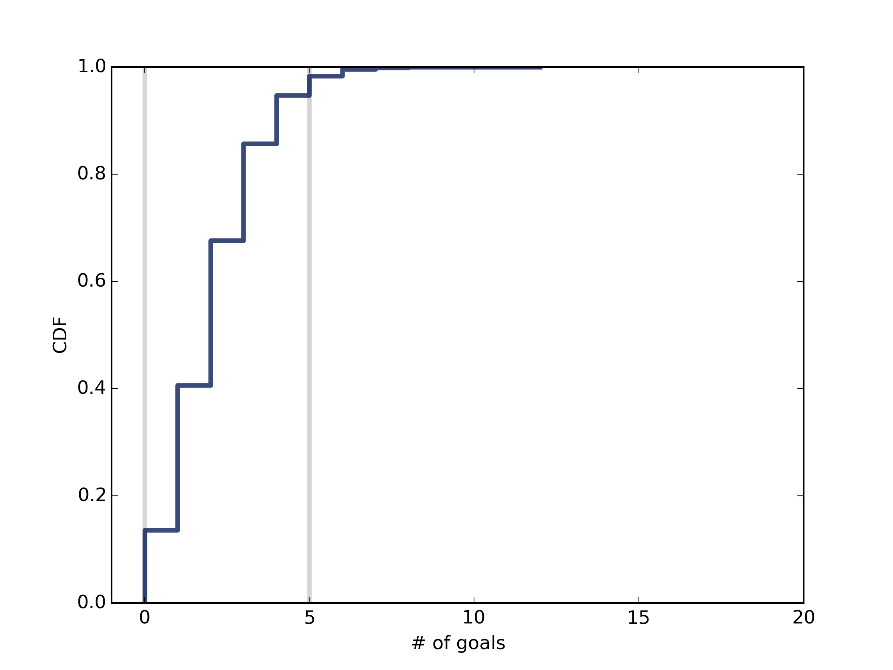

[Think Stats Chapter 8 Exercise 3](http://greenteapress.com/thinkstats2/html/thinkstats2009.html#toc77)

---

>> This exercise deals with estimating the lambda of an exponential distribution using a game-simulation method. The `getGameGoals` method takes a lambda argument and simulates a game by setting a time variable (`timeElapsed`) to 0.0 and a number of goals (`numGoals`) variable to 0, then generating random numbers from the exponential distribution with parameter lambda. These random values are meant to simulate the amount of time between goals, and once their cumulative time surpasses 1.0 (i.e. the length of one game), the game is over. The code for this function is below:

```
def getGameGoals(lam = 3):
    """Takes a goal-scoring rate (lam) measured
    in goals per game and simulates a game by
    generating the time between goals until the
    total time exceeds one game. Returns number of
    goals scored.

    lam: floating point goal scoring rate (note:
    np.random.exponential takes a beta = 1/lambda
    parameter)
    
    returns: goals scored in game
    """
    numGoals = 0
    timeElapsed = 0.0
    while timeElapsed <= 1.0:
        gTime = np.random.exponential(1.0 / lam)
        timeElapsed += gTime
        numGoals += 1
    return numGoals - 1
```

>> The function simulateNGames takes a parameter for number of games (`n`) and a parameter for lambda (`lam`), and generates a sequence of length `n` storing the number of goals scored in each game. It also plots the (necessarily discrete) CDF of the sampling distribution, and prints a number of useful statistics related to the simulation (max/min # of goals, mean error and RMSE of goals as an estimator of lambda, and the 90% confidence interval for the distribution). The function is copied below:

```
def simulateNGames(n = 1000, lam = 3):
    goals = []
    print n, 'trial games'
    for _ in range(n):
        goals.append(getGameGoals(lam))
    print 'max goals', np.max(goals)
    print 'min goals', np.min(goals)
    print 'mean error goals',
    		estimation.MeanError(goals, lam)
    print 'rmse goals', estimation.RMSE(goals, lam)
    
    cdf = thinkstats2.Cdf(goals)
    ci = cdf.Percentile(5), cdf.Percentile(95)

    print '90% confidence interval', ci
    vertLine(ci[0])
    vertLine(ci[1])
    thinkplot.Cdf(cdf)
    thinkplot.Config(xlim = (-1,20))
    thinkplot.Show()
```

>> For example, when the number of games is set to 1 million and lambda is set to 2, the minimum number of goals is 0, the maximum number of goals is 12, the mean error is -0.000919, the RMSE/standard error is 1.415, the 90% confidence interval is (0, 5), and the CDF looks like: 
>> 
>> This estimator for lambda seems like it is unbiased, as the mean error shrinks to 0 as the number of games/trials grows.
>> 
>> The full reproducible code (with thinkstats2.RandomSeed(10) set) is copied below.

```
import thinkstats2
import thinkplot
import numpy as np
import estimation

def getGameGoals(lam = 3):
    """Takes a goal-scoring rate (lam) measured
    in goals per game and simulates a game by
    generating the time between goals until the
    total time exceeds one game. Returns number of
    goals scored.

    lam: floating point goal scoring rate (note:
    np.random.exponential takes a beta = 1/lambda
    parameter)
    
    returns: goals scored in game
    """
    
    numGoals = 0
    timeElapsed = 0.0
    while timeElapsed <= 1.0:
        gTime = np.random.exponential(1.0 / lam)
        timeElapsed += gTime
        numGoals += 1
    return numGoals - 1

def simulateNGames(n = 1000, lam = 3):
	"""This function simulates n games using getGameGoals and 
		lambda parameter, then outputs relevant statistics for the 
		number of goals as estimator for lambda.
		
	n: number of simulations to run
	lam: lambda parameter
	
	returns: None
	"""
	
    goals = []
    print n, 'trial games'
    for _ in range(n):
        goals.append(getGameGoals(lam))
    print 'max goals', np.max(goals)
    print 'min goals', np.min(goals)
    print 'mean error goals', 
    		estimation.MeanError(goals, lam)
    print 'rmse goals', estimation.RMSE(goals, lam)
    
    cdf = thinkstats2.Cdf(goals)
    ci = cdf.Percentile(5), cdf.Percentile(95)

    print '90% confidence interval', ci
    vertLine(ci[0])
    vertLine(ci[1])
    thinkplot.Cdf(cdf)
    thinkplot.Config(xlim = (-1,20))
    thinkplot.Save(root = 'gamesCDFn' + str(n),
                   formats = ['png'],
                   xlabel = '# of goals', 
                   ylabel = 'CDF')


def vertLine(x, y = 1):
    thinkplot.Plot([x, x], [0, y], 
    				color = '0.8', linewidth = 3)


def main():
    thinkstats2.RandomSeed(10)
    for p in range(1,7):
        simulateNGames(n = 10**p, lam = 2)


if __name__ == '__main__':
    main()

```

---